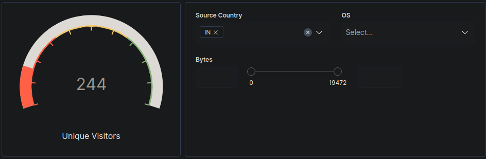
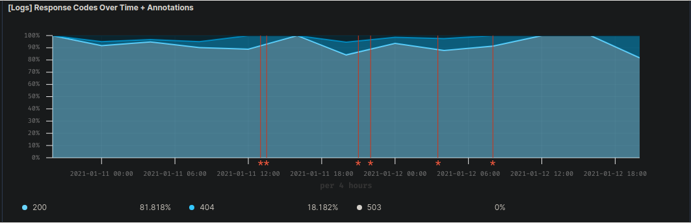
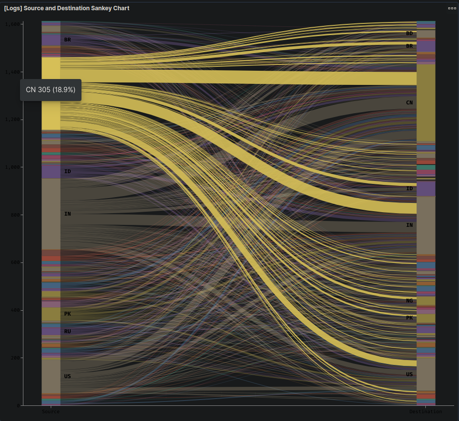
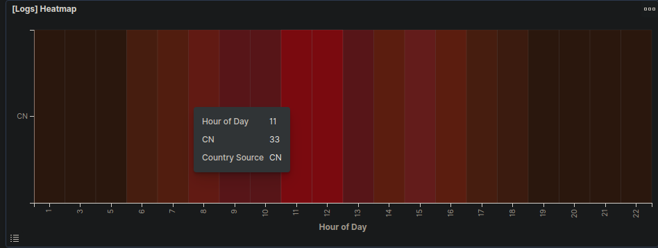
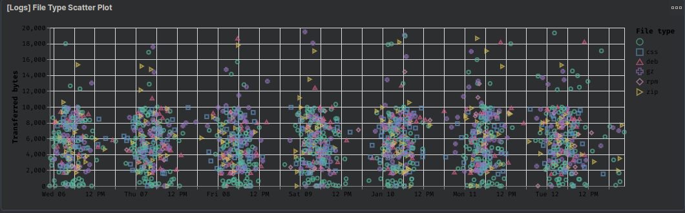
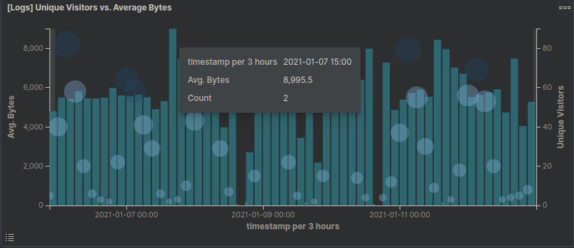
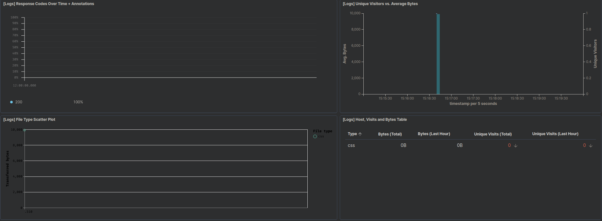
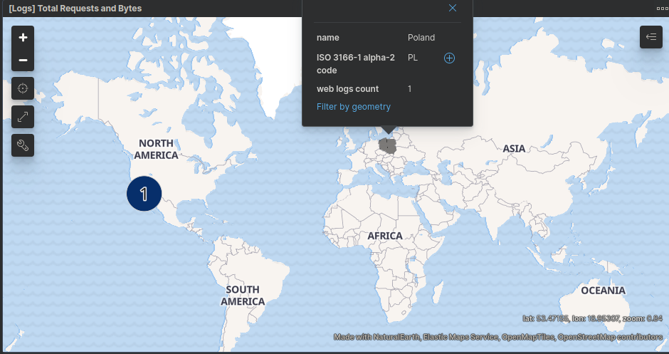

## Activity File: Exploring Kibana

* You are a DevOps professional and have set up monitoring for one of your web servers. You are collecting all sorts of web log data and it is your job to review the data regularly to make sure everything is running smoothly. 

* Today, you notice something strange in the logs and you want to take a closer look.

* Your task: Explore the web server logs to see if there's anything unusual. Specifically, you will:

:warning: **Heads Up**: These sample logs are specific to the time you view them. As such, your answers will be different from the answers provided in the solution file. 

---

### Instructions

1. Add the sample web log data to Kibana.
    - On the homepage click on `Load a data set and a Kibana dashboard` under `Add sample data`
    - Click `Add data` under the `Sample web logs` data pane
    - Click `View Data` to pull up the dashboard

2. Answer the following questions:

  - In the last 7 days, how many unique visitors were located in India?
      - 244

  - In the last 24 hours, of the visitors from China, how many were using Mac OSX?
      - 7

  - In the last 2 days, what percentage of visitors received 404 errors? How about 503 errors?
      - **404 Errors:** 18.182%
      - **503 Errors:** 0%

  - In the last 7 days, what country produced the majority of the traffic on the website?
      - China

  - Of the traffic that's coming from that country, what time of day had the highest amount of activity?
      - 11AM

  - List all the types of downloaded files that have been identified for the last 7 days, along with a short description of each file type (use Google if you aren't sure about a particular file type).
      - `css` - this is a programming language usually used for writing
          webpage elements and design
      - `deb` - compressed linux software package, used by debian-based distros 
          like ubuntu
      - `gz` - compressed archive using the gzip compression algorithm
      - `rpm` - similar to `deb` files, these are compressed linux software
          packages used in Red Hat Enterprise based distributions 
      - `zip` - compressed archive simislar to tarball or `gz` archive

3. Now that you have a feel for the data, Let's dive a bit deeper. Look at the chart that shows Unique Visitors Vs. Average Bytes.
   - Locate the time frame in the last 7 days with the most amount of bytes (activity).
       - **Avg Bytes:** ~9,000B
       - **Unique Visitors:** 2

   - In your own words, is there anything that seems potentially strange about this activity?
       - This seems strange because the amount of unique visitors was very
           low in comparison to other times. It would need more research, but
           this could indicate a user exfiltrating data.

4. Filter the data by this event.
     - What is the timestamp for this event?
         - **Timestamp:** 2021-01-07 15:16:40 

     - What kind of file was downloaded?
         - `css` 
         
     - From what country did this activity originate?
         - Poland

     - What HTTP response codes were encountered by this visitor?
         - 200

5. Switch to the Kibana Discover page to see more details about this activity.
     - What is the source IP address of this activity?
         - 159.148.160.139

     - What are the geo coordinates of this activity?
         - lat: 32.83422028
         - lon: -115.5787456 

     - What OS was the source machine running?
         - Windows XP

     - What is the full URL that was accessed?
         - https://cdn.elastic-elastic-elastic.org/styles/pretty-layout.css

     - From what website did the visitor's traffic originate?
         - http://www.elastic-elastic-elastic.com/warning/alexander-poleshchuk

6. Finish your investigation with a short overview of your insights. 

     - What do you think the user was doing?
         - Downloading a css layout, specifically a "pretty" one.

     - Was the file they downloaded malicious? If not, what is the file used for?
         - Likely it is not malicious, it is a stylesheet or layout for
             a webpage element. This is used for asthetics and theming.

     - Is there anything that seems suspicious about this activity?
         - Not particularly without seeing the actual file itself. This would
             be considered a normal action when visiting a webpage. 

     - Is any of the traffic you inspected potentially outside of compliance guidlines?
         - Unless there is a data download or bandwidth cap of some sort, this
             looks like it falls within normal user behavior. 

---
© 2020 Trilogy Education Services, a 2U, Inc. brand. All Rights Reserved.  
