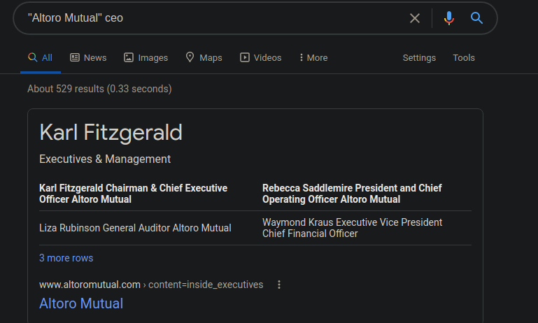

## Week 16 Homework Submission File: Penetration Testing 1

#### Step 1: Google Dorking

- Using Google, can you identify who the Chief Executive Officer of Altoro Mutual is:

- How can this information be helpful to an attacker:
This may be useful as the attacker may look into the CEO's social media or
launch a "spear phishing" campaign to gain any information or credientials to
help them attack this company. 

#### Step 2: DNS and Domain Discovery

Enter the IP address for `demo.testfire.net` into Domain Dossier and answer the following questions based on the results:

  1. Where is the company located: 
  - Sunnyvale, CA

  2. What is the NetRange IP address:
  - 65.61.137.64 - 65.61.137.127

  3. What is the company they use to store their infrastructure:
  - Rackspace Backbone Engineering

  4. What is the IP address of the DNS server:
  - 65.61.137.117

#### Step 3: Shodan

- What open ports and running services did Shodan find:
  - **Ports:** 80/tcp, 443/tcp, 8080/tcp
  - **Services:** Apache Tomcat/Coyote JSP engine ver 1.1

#### Step 4: Recon-ng

- Install the Recon module `xssed`. 
- Set the source to `demo.testfire.net`. 

- Run the module. 

Is Altoro Mutual vulnerable to XSS: 
- Yes

### Step 5: Zenmap
***I was told by Andrew that I could use `nmap` instead (in class 2/6)***

Your client has asked that you help identify any vulnerabilities with their file-sharing server. Using the Metasploitable machine to act as your client's server, complete the following:

- Command for Zenmap to run a service scan against the Metasploitable machine: 
  `nmap -sV 192.168.0.10`
 
- Bonus command to output results into a new text file named `zenmapscan.txt`:
  `nmap -sV 192.168.0.10 -oN nmapscan.txt`

- Zenmap vulnerability script command: 
  `nmap -p T445,T:139 --script=smb-enum-shares 192.168.0.10`

- Once you have identified this vulnerability, answer the following questions for your client:
  1. What is the vulnerability:
    - CVE-2010-1182 
    - This vulnerability exists because the RPC generator in multiple versions
      of Samba 3.x does not validate array length consistently with array
      memory allocation.  This target machine is running `Samba 3.0.20-debian`
      and is suceptible to this vulnerability.

  2. Why is it dangerous:
    - This vulnerability allows an attacker to execute arbitrary code on the
      target via a crafted RPC call. 

  3. What mitigation strategies can you recommendations for the client to protect their server:
    - Patch and update the the Samba server. 

---
© 2020 Trilogy Education Services, a 2U, Inc. brand. All Rights Reserved.  

