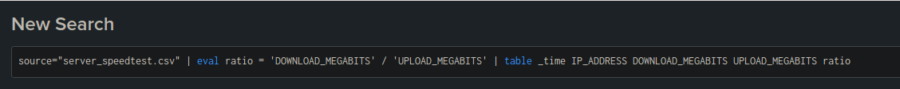
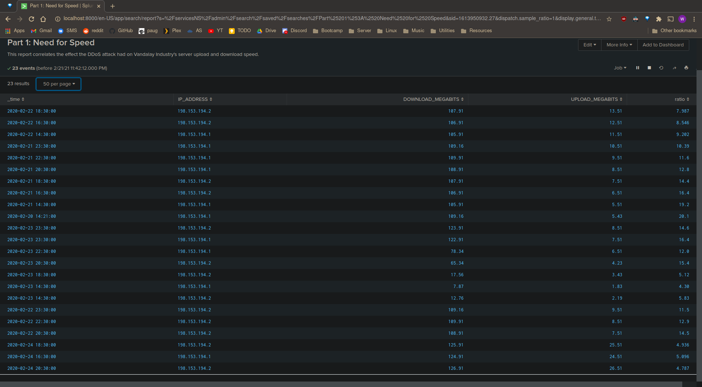
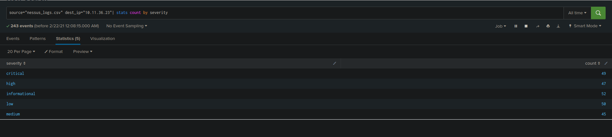
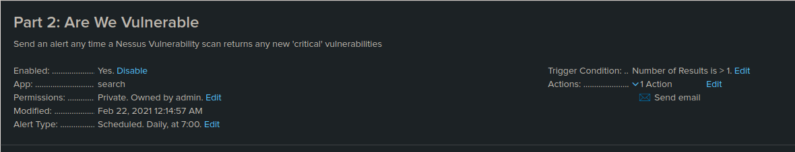
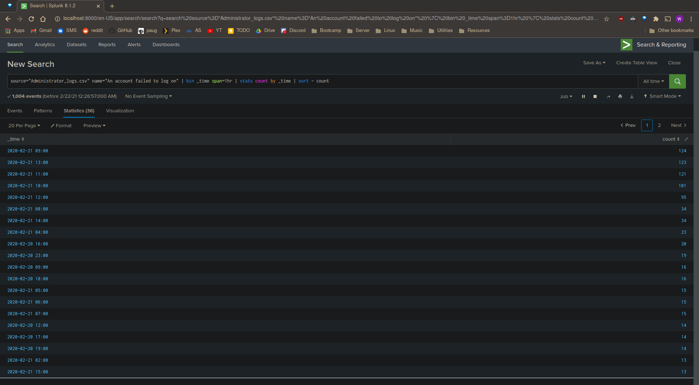
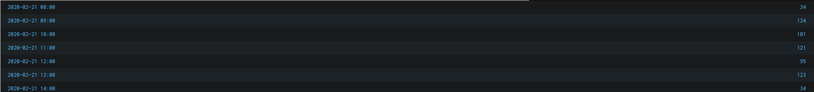
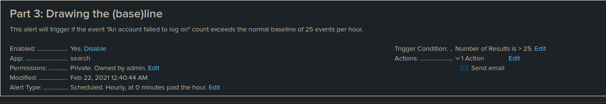

# Part 1: Need For Speed

1. Uploaded the `server_spreadsheet.csv` file into Splunk for auditing

2. Formulated a search to create the `ratio` field to correlate the upload and
   download speeds and how they were effected of the DDoS attack.

3. Below is the ouptut of the search in table form with the new `ratio` field

4. Question responses

  - The approximate time and date of the attack was on 2020-02-23 starting
      around 14:30:00
  - The approximate time it took for Vandalay's systems to recover was about
      9 hours, around 23:30:00.

# Part 2: Are We Vulnerable

1. Uploaded the `nessus.csv` file into Splunk for auditing

2. Search for database server IP, count the number of `critical` severity level

3. Pictures

# Part 3: Drawing the (base)line

1. Uploaded the `Administrator_logs.csv` file into Splunk for auditing

2. Search for an event with `An account failed to login` in the event name,
   count number of events per hour, and sort to aide in finding the approximate
   attack time.

  - It seems that the attack occured starting on 2020-02-21 at 08:00:00 and
      continued until 14:00:00 on the same day. 

3. Taking the average of the times when the attack was not in progress, a good
   baseline for failed login attempts for Vandaly Industries is around 25 per
   hour. 

4. Set an alert if the event count failed logins exceeds the baseline of 25 an hour. 

