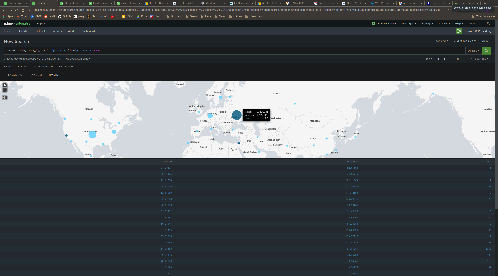

# Part 1: Windows Server Attack

## Question 1
- Several users were impacted during the attack on March 25th.
- Based on the attack signatures, what mitigations would you recommend to 
   protect each user account? Provide global mitigations that the whole 
   company can use and individual mitigations that are specific to each user.

### Findings
- Signature: `An attempt was made to reset an accounts password` 
  - 295 events - normal
  - 2128 events - attack

This could be mitigated by setting a minimum time for a password to exist, 
unless manually intervened by an admin. Alternatively, it is possible to 
only require admin intervention for passwords, but this would likely overload 
the admin staff with work. 

A global mitigation strategy would be to enable 2FA for logins and password resets.

## Question 2
- VSI has insider information that JobeCorp attempted to target users by sending "Bad Logins" to lock out every user.
- What sort of mitigation could you use to protect against this?

Similar to the mitigation from the above question, if 2FA was enabled, it would
make it extremely difficult cause a DDoS by locking out accounts. 

# Part 2: Apache Webserver Attack

## Question 1
- Based on the geographic map, recommend a firewall rule that the networking team should implement.
- Provide a "plain english" description of the rule.
  - For example: "Block all incoming HTTP traffic where the source IP comes from the city of Los Angeles."
- Provide a screen shot of the geographic map that justifies why you created this rule. 

### Firewall Rule
- Block all incoming HTTP traffic where the source IP comes the from the city
    of Kiev, Ukraine.

## Question 2
- VSI has insider information that JobeCorp will launch the same webserver attack but use a different IP each time in order to avoid being stopped by the rule you just created.
- What other rules can you create to protect VSI from attacks against your webserver?
  - Conceive of two more rules in "plain english". 
  - Hint: Look for other fields that indicate the attacker.

### Firewall Rules
- Block all incoming HTTP traffic where the source HTTP Method is `POST
    /VSI_Account_logon.php HTTP/1.1`
- Block all incoming HTTP traffic where the source User-Agent is `Mozilla/4.0
    (compatible; MSIE 6.0; Windows NT 5.2; SV1; .NET CLR 2.0.50727987787;
    InfoPath.1)`
